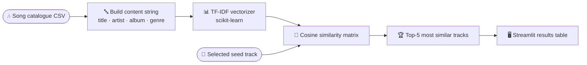

<div align="center">


# 🎵 Instant Music Recommendation System

### Pick a song — get **five similar tracks** instantly, powered by **TF-IDF** content similarity.

<p>
  
  
  
  
  
</p>

<p>
  <a href="#-overview"><b>Overview</b></a> ·
  <a href="#-how-it-works"><b>How it works</b></a> ·
  <a href="#-quick-start"><b>Quick Start</b></a> ·
  <a href="#-data"><b>Data</b></a>
</p>

</div>

---

> A lightweight, content-based recommender. It turns each track's metadata — title, artist, album, genre, release date — into a **TF-IDF** vector, measures **cosine similarity** between every pair, and returns the five closest tracks to whatever you select. All wrapped in a clean, Spotify-styled **Streamlit** UI.

---

## 📑 Table of Contents

- [✨ Features](#-features)
- [🧠 How It Works](#-how-it-works)
- [⚡ Quick Start](#-quick-start)
- [🚀 Running It](#-running-it)
- [🗃️ Data](#-data)
- [📸 Screenshots](#-screenshots)
- [🧰 Tech Stack](#-tech-stack)
- [📄 License](#-license)

---

## ✨ Features

- 🧠 **Content-based filtering** — recommendations come from track *content*, no ratings or user history needed.
- 🔤 **TF-IDF vectorization** over combined textual features (title · artist · album · genre · release date).
- 📐 **Cosine similarity** ranks the catalogue and returns the top-5 closest songs.
- 🎨 **Spotify-inspired Streamlit UI** with a one-click "Show Recommendations" flow.
- ⚡ **Cached data loading** (`@st.cache_data`) for instant repeat queries.

---

## 🧠 How It Works



---

## ⚡ Quick Start

```bash
git clone https://github.com/AyushDas4890/Instant-music-recommendation-system-using-Machine-Learning.git
cd Instant-music-recommendation-system-using-Machine-Learning

python -m venv venv
source venv/bin/activate          # Windows: venv\Scripts\activate

pip install -r requirements.txt
```

---

## 🚀 Running It

```bash
streamlit run main.py             # opens http://localhost:8501
```

Pick a seed track from the dropdown, hit **Show Recommendations**, and the five most similar songs appear instantly.

---

## 🗃️ Data

The app loads a catalogue CSV at startup:

```python
df = pd.read_csv("Top 100 most Streamed - Sheet1.csv")
```

Make sure **`Top 100 most Streamed - Sheet1.csv`** sits in the project root. Expected columns (mapped automatically): `title`, `artist`, `top genre`, `year` — plus optional `album`, `release_date`, `popularity`. Any missing column is filled gracefully.

---

## 📸 Screenshots

> _Add a screenshot/GIF of the recommender in action._
> ```markdown
> 
> ```

---

## 🧰 Tech Stack

`Python` · `Streamlit` · `scikit-learn (TF-IDF + cosine similarity)` · `Pandas`

---

## 📄 License

Released under the **MIT License** © 2026 Ayush Das. _(Add a `LICENSE` file if not present.)_

<div align="center"><sub>Content-based music discovery, one click away.</sub></div>
