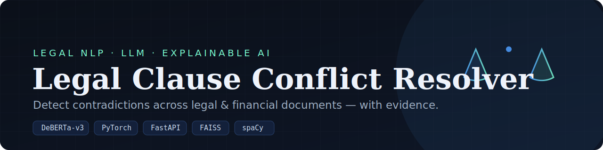
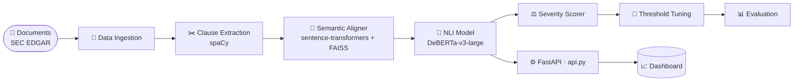

<div align="center">



# ⚖️ Legal Clause Conflict Resolver

### An end-to-end **Legal NLP** pipeline that detects contradictions across legal &amp; financial documents — and shows you the evidence.

<p>
  
  
  
  
  
  85%25-2ea043">
  
</p>

<p>
  <a href="#-overview"><b>Overview</b></a> ·
  <a href="#-architecture"><b>Architecture</b></a> ·
  <a href="#-pipeline-modules"><b>Modules</b></a> ·
  <a href="#-quick-start"><b>Quick Start</b></a> ·
  <a href="#-results"><b>Results</b></a>
</p>

</div>

---

> Feed it legal or financial filings. The pipeline ingests documents, extracts clauses, aligns semantically related ones, runs **Natural Language Inference** to flag contradictions, scores their severity, and serves the results through a **FastAPI** backend and analytics dashboard — every flagged conflict comes with the cross-attention evidence behind it.

---

## 📑 Table of Contents

- [✨ Features](#-features)
- [🧠 Architecture](#-architecture)
- [🧩 Pipeline Modules](#-pipeline-modules)
- [⚡ Quick Start](#-quick-start)
- [🚀 Running It](#-running-it)
- [📊 Results](#-results)
- [📸 Screenshots](#-screenshots)
- [🧰 Tech Stack](#-tech-stack)
- [🗺 Roadmap](#-roadmap)
- [📄 License](#-license)

---

## ✨ Features

- 🧠 **DeBERTa-v3-large NLI** fine-tuned for contradiction detection between clause pairs.
- 🎯 **>85% validation accuracy**, reached through dedicated **threshold tuning** and model optimization.
- 🔍 **Explainable AI** — cross-attention heatmaps surface the exact tokens driving each contradiction.
- 🧭 **Semantic clause alignment** with sentence-transformers + **FAISS** to compare only related clauses.
- 📥 **Real document ingestion** from SEC EDGAR filings (`sec-edgar-downloader`).
- 📈 **Severity scoring** ranks conflicts so the highest-risk ones surface first.
- ⚙️ **FastAPI backend** + analytics **dashboard** for real-time conflict analysis.

---

## 🧠 Architecture



---

## 🧩 Pipeline Modules

| File | Role |
|------|------|
| `data_ingestion.py` | Pulls and cleans legal/financial filings (SEC EDGAR) |
| `clause_extractor.py` | Segments documents into individual clauses with spaCy |
| `semantic_aligner.py` | Embeds clauses and finds semantically related pairs via FAISS |
| `nli_model.py` | DeBERTa-v3 NLI head — classifies entailment / neutral / **contradiction** |
| `severity_scorer.py` | Scores how serious each detected conflict is |
| `threshold_tune.py` | Tunes decision thresholds to maximize validation accuracy |
| `eval_nli.py` · `download_and_eval.py` | Evaluation harness and metrics |
| `pipeline.py` · `run_pipeline.py` | Orchestrate the full end-to-end run |
| `api.py` | FastAPI backend exposing the analysis endpoints |
| `dashboard/` | Analytics dashboard for real-time conflict review |

---

## ⚡ Quick Start

```bash
git clone https://github.com/AyushDas4890/Legal-Conflict-Resolver.git
cd Legal-Conflict-Resolver

python -m venv venv
source venv/bin/activate          # Windows: venv\Scripts\activate

pip install -r requirements.txt   # installs torch, transformers, spaCy model, FastAPI, FAISS…
python verify_deps.py             # sanity-check the environment
```

---

## 🚀 Running It

<details open>
<summary><b>Run the full pipeline</b></summary>

```bash
python run_pipeline.py
```
Ingests documents → extracts clauses → detects contradictions → scores severity → writes results.
</details>

<details>
<summary><b>Serve the API + dashboard</b></summary>

```bash
uvicorn api:app --reload          # http://localhost:8000
```
Send document pairs to the API and review flagged conflicts (with evidence) in the dashboard.
</details>

---

## 📊 Results

| Metric | Value |
|--------|-------|
| Task | Clause-pair contradiction detection (NLI) |
| Backbone | `microsoft/deberta-v3-large` |
| Validation accuracy | **> 85%** (after threshold tuning) |
| Explainability | Cross-attention heatmaps per prediction |

---

## 📸 Screenshots

> _Add a screenshot or GIF of the dashboard + a heatmap here once you run it locally._
> Save images under `docs/` and reference them:
>
> ```markdown
> 
> 
> ```

---

## 🧰 Tech Stack

`PyTorch` · `🤗 Transformers (DeBERTa-v3-large)` · `sentence-transformers` · `FAISS` · `spaCy` · `scikit-learn` · `FastAPI` · `Uvicorn` · `Plotly` · `Matplotlib` · `sec-edgar-downloader`

---

## 🗺 Roadmap

- [ ] Support uploaded PDFs/DOCX directly from the dashboard
- [ ] Multi-document batch conflict reports
- [ ] Confidence calibration + per-clause export
- [ ] Dockerfile for one-command deploy

---

## 📄 License

Released under the **MIT License** © 2026 Ayush Das. _(Add a `LICENSE` file if not present.)_

<div align="center"><sub>Built with DeBERTa-v3, FAISS, and a focus on explainable legal AI.</sub></div>
